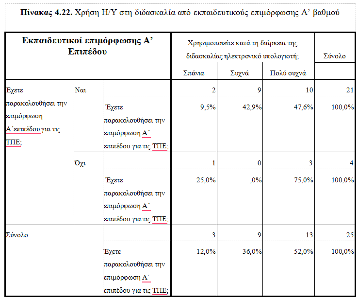
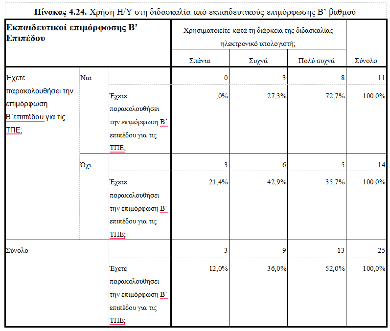
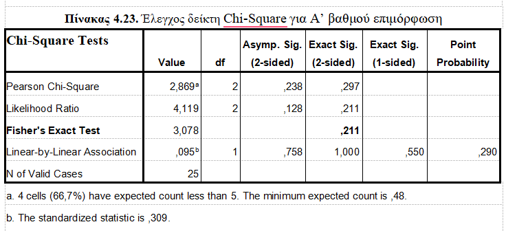

# 💻 ICT Usage in Primary Education — Data Analysis Project (SPSS)

This repository showcases a complete **data analysis project** focused on the use of Information and Communication Technologies (ICT) by primary school teachers.  
The project demonstrates skills in **quantitative research**, **statistical analysis**, **SPSS syntax**, and **data-driven reporting**.

This work was originally completed as part of a postgraduate program in *Special Education & Teaching* (University of Patras, 2022).

---

## 👤 Author

**Despoina Fostiropoulou**

---

# 🎯 Project Overview 

The purpose of this study was to investigate: 
1. **The percentage of primary school teachers who use ICT in their teaching practice**
2. **The frequency of ICT usage in the classroom**
3. **The ways ICT tools are integrated into instruction**
4. **Whether teachers who attended ICT training programs (Level A or B) use ICT more frequently than those who did not**

The research followed a **quantitative methodology**, using a structured questionnaire and statistical analysis performed in **SPSS**.

---

## 🧪 Methodology 
### **Research Design** 
- **Type:** Quantitative, cross-sectional study
- **Data Collection:** Structured questionnaire (25 items)
- **Participants:** Primary school teachers in Greece
- **Period:** March–April 2022

### **Variables** 
- **Demographic variables:** gender, age, teaching experience, employment status, specialty, grade taught
- **ICT-related variables:** availability of computer in classroom, frequency of use, hours per day, weekly usage
- **Instructional ICT usage:** educational software, presentations, internet search, video/audio use, educational games, email communication, etc.
- **Training variables:** participation in ICT training (Level A / Level B)

---

### **Statistical Methods** 
- Descriptive statistics (frequencies, percentages)
- Cross-tabulations
- **Chi-Square tests** to examine relationships between ICT training and ICT usage

The full SPSS syntax used for the analysis is included in the file: `analysis_spss.sps` 

---

## 🧠 Research Questions

The analysis focuses on:

1. **How frequently do teachers use ICT in the classroom?**  
2. **Which ICT tools are used most often?**  
3. **Does ICT training (Level A or B) influence usage frequency?**  
4. **What factors affect ICT adoption in primary education?**

---

## 📈 Statistical Methods Used

### **1. Descriptive Statistics**
Used to summarize:
- demographics  
- ICT availability  
- frequency of ICT use  
- instructional ICT practices  

### **2. Chi-Square Tests**
Used to test whether:
- ICT training (Level A)
- ICT training (Level B)

are associated with:
- frequency of ICT usage  
- level of ICT integration  

---

## 🔍 Key Findings (Summary) 
- Most teachers reported **positive attitudes** toward ICT integration.
- ICT usage frequency varied significantly depending on **infrastructure availability** and **training level**.
- Teachers who completed **Level A or Level B ICT training** demonstrated **higher usage rates** of ICT tools.
- ICT was most commonly used for:
   - educational software
   -  video and audio materials
   -  internet searches
   -  presentations

---

## 📸 Visual Outputs

Below are selected screenshots from the SPSS analysis, including descriptive statistics, cross-tabulations, and Chi-Square test results.

### 📊 Descriptive Statistics

  
  

### 🔍 Cross-Tabulation Example

  
   

### 🧪 Chi-Square Test Output

   
  

---

### 📄 Questionnaire
[**Click here to view the questionnaire (PDF)**](questionnaire.pdf)
